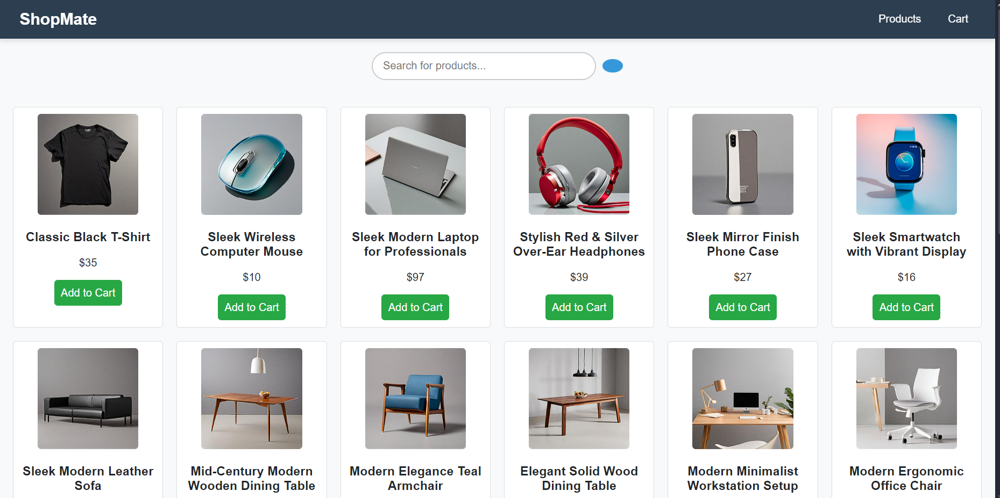

# shopping-cart# Shopping Cart

A simple shopping cart app using React with Vite and Platzi Fake Store API.

## How to Run

```bash
npm install
npm run dev
npm vite install
```

click the link and you're good to go!

Libraries Used

📦 shopping-cart-app
├── 📄 package.json
├── 📂 src
│ ├── 📂 components
│ ├── 📂 contexts
│ ├── 📂 pages
│ └── 📂 utils
├── 📦 Dependencies
│ ├── react
│ ├── react-dom
│ ├── react-router-dom
│ ├── react-scripts
│ ├── vite
│ └── vite-plugin-react
└── 📦 Dev Dependencies
├── eslint
├── prettier
└── eslint-plugin-react


